<h1 align="center">Femto Shell Extension</h1>

<div align="center">

[](https://github.com/ehababdalnaby/Femto-Unix-Utilities-pwd-echo-cp-mv/issues)
[](https://github.com/ehababdalnaby/Femto-Unix-Utilities-pwd-echo-cp-mv/pulls)
[](https://github.com/ehababdalnaby/Femto-Unix-Utilities-pwd-echo-cp-mv)

</div>

---

## 📝 Table of Contents

- [1. Prerequists](#Prerequists)
- [2. Compilation command](#Compilation_command)
- [3. Main features](#Main_features)
  - [1. Executing external commands](#Executing_external_commands)
  - [2. Set local variables](#Set_local_variables)
  - [3. export local to env](#export)
- [4. Extra feature](#extra)
  - [1. cd command](#cd)
  - [2. IO redirection](#redirection)
  - [3. Pipe feature](#pipe)
  - [4. edit input line](#)
  - [5. Previos command using up and down keys](#)
  - [6. Support commands from assignment #2](#old)

---

## 1. Prerequists <a name = "Prerequists"></a>

install readline library.

- ### ⛏️ Command

    ```$ sudo apt-get install lib32readline8 lib32readline-dev```

## 2. Compilation command <a name = "Compilation_command"></a>

- ### ⛏️ compilation command

    ```$ gcc -o shell prompt/prompt.c tokenizer/tokenizer.c main.c variables/vars.c executer/executer.c builtincmd/builtinCMD.c -lreadline```

- ### 💻 output

    >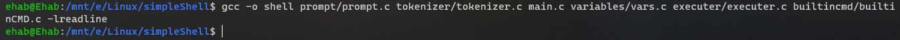

---

## 3. Main features <a name = "Main_features"></a>

- ### 1. Executing external commands <a name = "Executing_external_commands"></a>

- #### Examples

- #### 💻 ls -l

    >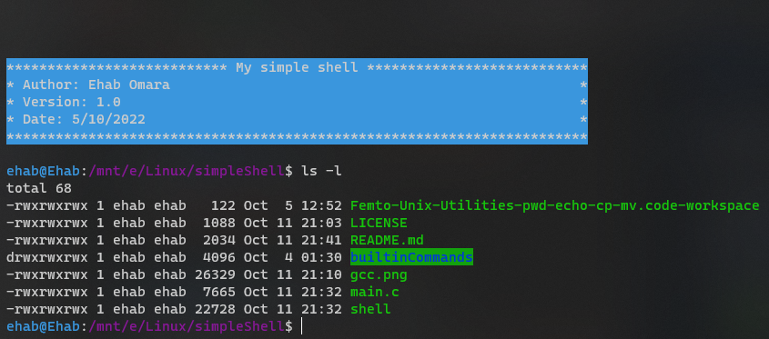

- #### 💻 ps -l

    >

- ### 2. Set local variables <a name = "Set_local_variables"></a>

- ####  Examples

- #### 💻 Local variables

    >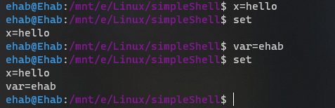

- ### 3. export local to env <a name = "export"></a>

- ####  Examples

- #### 💻 export Local variables

    >

    >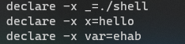

---

## 4. Extra feature <a name = "extra"></a>

- #### 1. cd command <a name = "cd"></a>

- ####  Examples

- #### 💻 cd command output

    >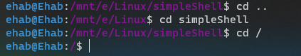

- ### 2. IO redirection <a name = "redirection"></a>

- ####  Examples

- #### 💻 Output redirection

    >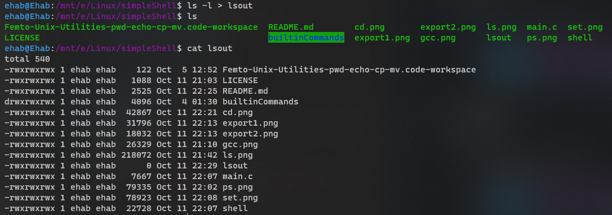

- #### 💻 Error redirection

    >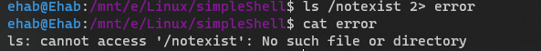

- #### 💻 Output and error redirection

    >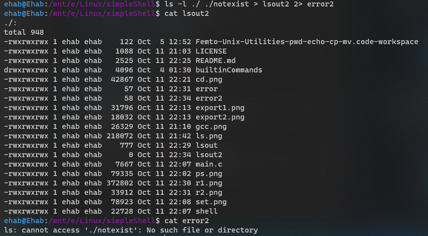

- #### 💻 Input redirection

    >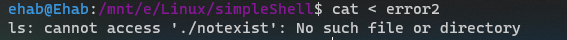

- ### 3. Pipe feature <a name = "pipe"></a>

- ####  Examples

- #### 💻 Output redirection

    >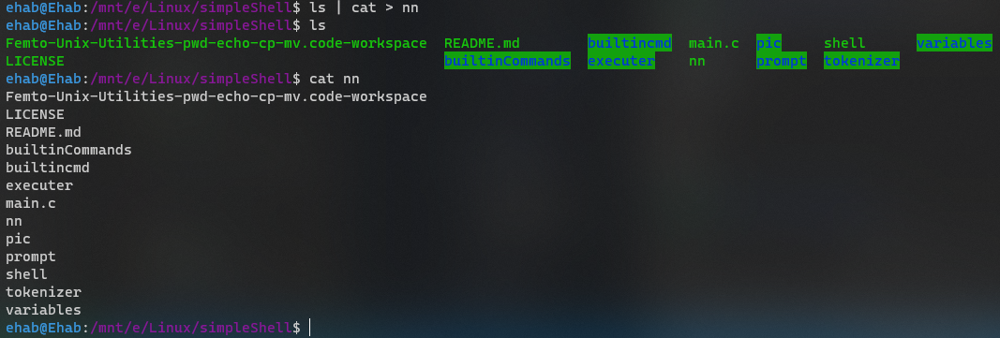

    >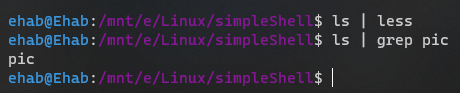

- ### 6. Support commands from [assignment #2](https://github.com/ehababdalnaby/Femto-Unix-Utilities-pwd-echo-cp-mv)<a name = "old"></a>

- #### 💻 Output

        >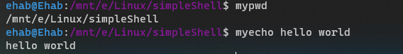
